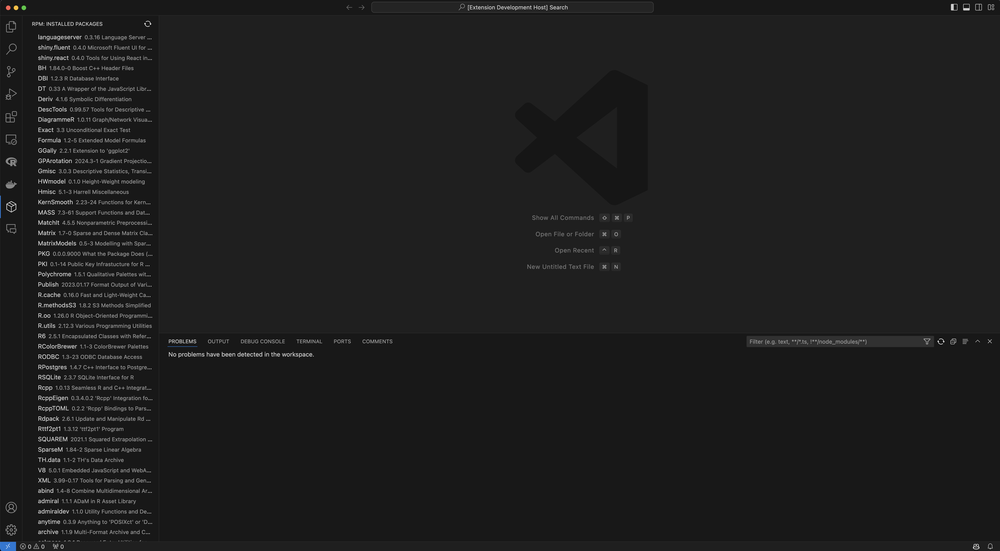

# RPM: R Package Manager

This is a Visual Studio Code extension for managing R packages. It is designed to be a lightweight alternative to RStudio's package manager.

## Features

- Works in **Positron**
- List installed R packages

> Note, This is a work in progress. and I don't have complete understanding in VS Code extension development. I am learning as I go.

Following features are planned:

- Update all outdated R packages (based on CRAN)
- See package details
- Maybe using `pak` package for package management

For example if there is an image subfolder under your extension project workspace:

## Known Issues

- When update all outdated R packages, it will update all packages without showing progress / status.
- Also, every R package will installed at USER-LIBRARY not SYSTEM-LIBRARY.

**Enjoy!**
